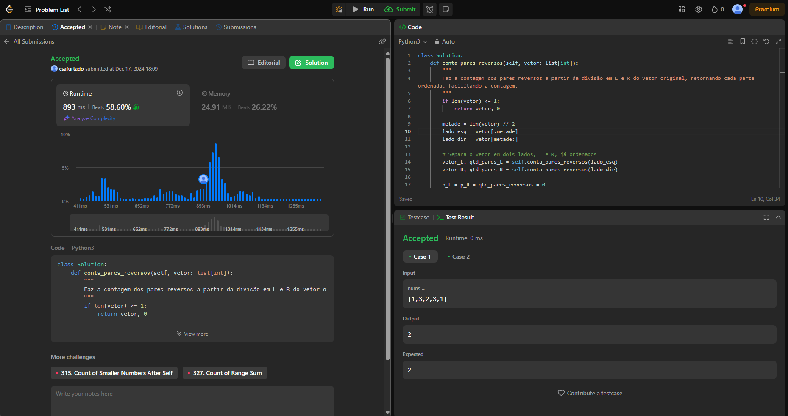

# Exercícios do Juiz Online LeetCode

**Número da Lista**: 49 
**Conteúdo da Disciplina**: Dividir e Conquistar 

## Alunos
|Matrícula | Aluno |
| -- | -- |
| 17/0008291  |  Cristian Furtado |
| 21/1041043 |  Juan Pablo |

## Sobre 
Serão realizados 3 exercícios na plataforma no LeetCode que são:

- <a href="https://leetcode.com/problems/continuous-subarrays/description/">2762. Sub-arrays contínuos (Médio)</a>
- <a href="https://leetcode.com/problems/count-of-smaller-numbers-after-self/description/">0315. Contagem de números menores depois do mesmo (Difícil)</a>
- <a href="https://leetcode.com/problems/reverse-pairs/description/">0493. Pares reversos (Difícil)</a>

## Screenshots

## Instalação 
**Linguagem**: Python 3.10.* 

Necessário ter instalado na máquina versão do Python 3.10.* para que sejam executados os exercícios e uma conta no site LeetCode.

## Uso 
Explique como usar seu projeto caso haja algum passo a passo após o comando de execução.

## Outros 
Quaisquer outras informações sobre seu projeto podem ser descritas abaixo.

## Links dos vídeos com explicação
[Exercício 0493](https://drive.google.com/file/d/1ajTsK3Q4FB45POrNL_bjZgXpLYtz6qOA/view?usp=sharing)

[Exercício 2762](https://drive.google.com/file/d/1F8aWO63GOgBN_zqtMuT2fy0pZ2GJLe2f/view?usp=sharing)

[Exercício 0315](https://drive.google.com/file/d/1Lx93gHSVNYUAgxR0Ded0eaA5KaivY5ur/view?usp=sharing)